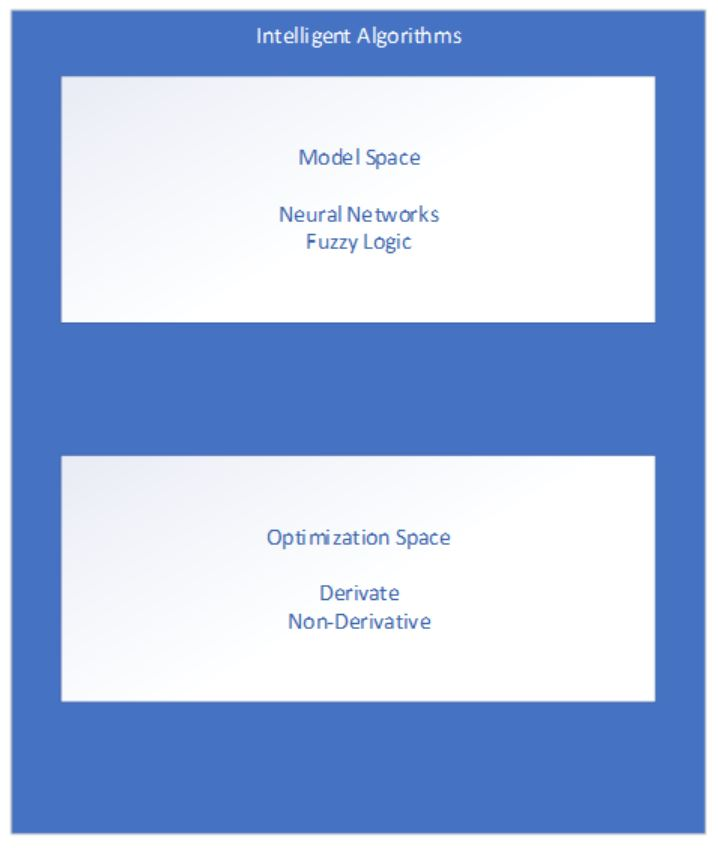
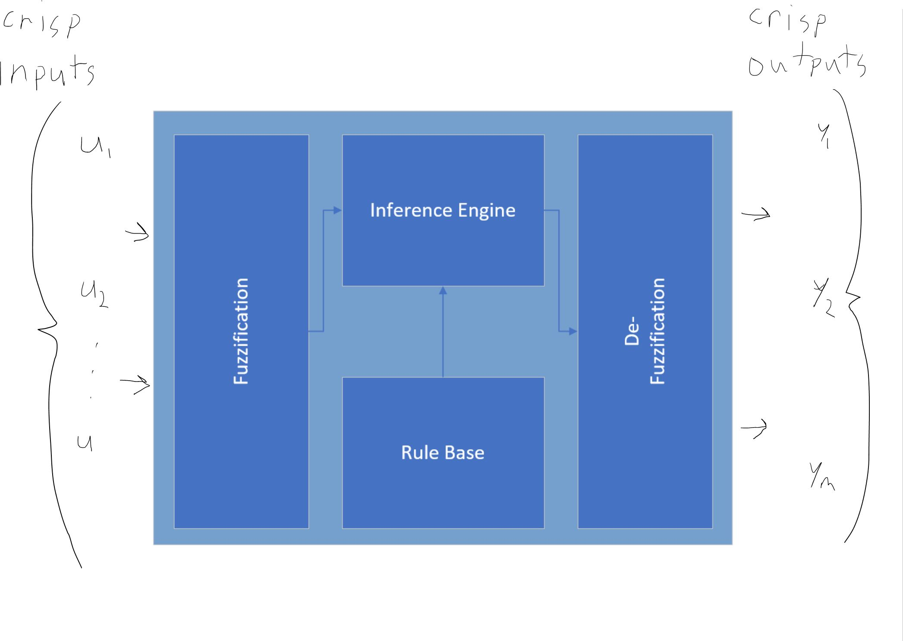
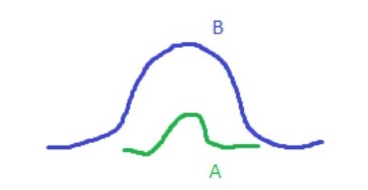
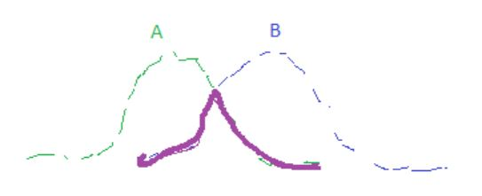
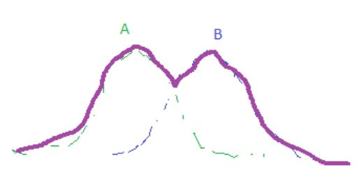
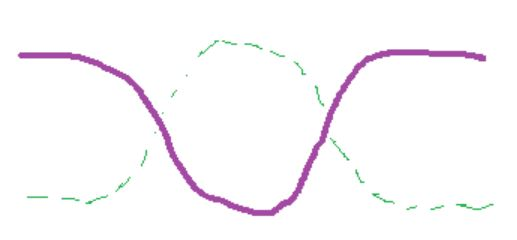
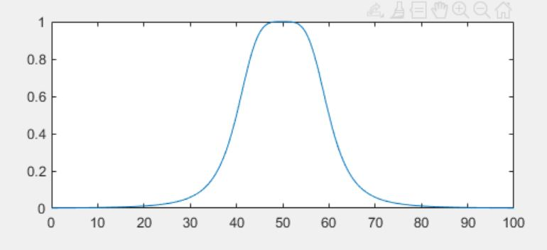
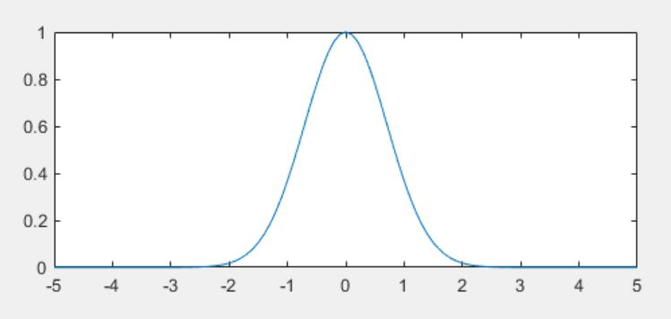

# Intelligent Algorithms

## Simplified Representation of an Intelligent Algorithm
- Derivative free: Genetic Algorithms, Particle Swarm Optimization, Ant Colony Optimization
- Derivative/Gradient Based: Least Squares, Newtonian

## Fuzzy Inference Systems

**Set**: A collection of clearly defined objects/concepts/symbols
- Contained elements are called members
- List: name all members of a set
- Rule: specify properties for membership
- Classical/Bivalent: crisp boundaries
- Fuzzy: Containment to some degree

**Universe of Discourse**: Universal set containing all possible elements in a context/application

**Characteristic Function**: Indicates whether an element is a member

**Membership Function**: In a fuzzy context, determines the degree of membership

**Subset**: With respect to universe $X$, if $x \in A$, then $x \in X$, then $A \subseteq X$

**Proper Set**: $A \subseteq X$ and $y \in X$ and $y \notin A$ then $A \subset X$

**Complement**: $\overline{A} = \{ x \mid x \in X \text{ and } x \notin A \}$

- $\overline{\overline{A}}$ = $A$
- $\overline{EmptySet}$ = $X$
- $\overline{X} = EmptySet$

**Union** $A \cup B = \{x \mid x \in A \text{ or } x \in B \}$

- $A \cup X = X$
- $A \cup EmptySet = A$
- $A \cup \overline{A} = X$

**Intersection**: $A \cap B = \{ x \mid x \in A \text{ and } x \in B \}$

- $A \cap X = A$
- $A \cap EmptySet = EmptySet$
- $A \cap \overline{A} = EmptySet$

## Identities

|||
|---|---|
| Law of Contradiction | $A \cap \overline{A} = EmptySet$ |
| Law of Excluded Middle | $A \cup \overline{A} = X$ |
| Idempotency | $A \cap A = A; A \cup A = A$ |
| Involution | $\overline{\overline{A}} = A$ |
| Commutativity | $A \cap B = B \cap A$; $A \cup B = B \cup A$ |
| Associativity | $(A \cup B) \cup C = A \cup (B \cup C); (A \cap B) \cap C = A \cap (B \cap C)$ |
| Distributivity | $(A \cup B) \cap (A \cup C) = A \cup (B \cap C); (A \cap B) \cup (A \cap C) = A \cap (B \cup C) $ |
| Absorption | $A \cup (A \cap B) = A; A \cap (A \cup B) = A$ |
| Absorption of Compliment | $A \cup (\overline{A} \cap B) = A \cup B; A \cap (\overline{A} \cup B) = A \cap B$ |
| DeMorgan's Law| $\overline{A \cup B} = \overline{A} \cap \overline{B}; \overline{A \cap B} = \overline{A} \cup \overline{B} $ |

**Fuzzy Subset (Containment)**: $A \subseteq B <=> \mu_A(x) \le \mu_B(x)$ 

**Fuzzy Intersection (Conjunction)**: $C = A \cap B$

$\mu_C = min(\mu_A(x), \mu_B(x)) = \mu_A(x)$ ^ $\mu_B(x)$

**Fuzzy Union (Disjunction)**: $C = A \cup B$

$\mu_C = max(\mu_A(x), \mu_B(x)) = \mu_A(x)$ v $\mu_B(x)$

**Fuzzy Complement (Negation)**: $\overline{A}$

$\mu_A(x) = 1 - \mu_A(x)$

### Representations (Continuous, Discrete)

- / is a mark of separation, not division
- Summation/integral denotes union of pairs

**Continuous**: $A = \int_{x} \mu_A(x) / x$

**Discrete**: $A = \sum_{x_i \in X} \mu_A(x_i) / x_i$

### Fuzzy Set Examples

#### Example: C represents "interesting city to live in"

- Description 1: $C = \{ (San Francisco, 0.9),(Boston, 0.8),(Los Angeles, 0.6),(Philadelphia, 0.7),(New York, 0.85), (Baltimore, 0.5), \dots \}$
- Description 2: $C = 0.9/San Francisco + 0.8/Boston + 0.6/Los Angeles + 0.7/Philadelphia + 0.85/New York + 0.5/Baltimore + \dots$

#### Example: A represents "sensible number of credit cards"

- Description 1: $A = \{(0,0.1),(1,0.3),(2,0.7),(3,1),(4,0.7),(5,0.3),(6,0.1)  \}$
- Description 2: $A = 0.1/0 + 0.3/1 + 0.7/2 + 1.0/3 + 0.7/4 + 0.3/5 + 0.1/6 $

#### Example: B represents "about 50 years old"

- Description 1: $\{(x, \mu_B(x)) \mid x \in X \} , \mu_B(x) = \frac{1}{1 + (\frac{x-50}{10})^4}$
- Description 2: $\int_{R+} \frac{1}{1 + (\frac{x-50}{10})^4} / x$

#### Example: D represents "close to zero"

- Description 1: $D = \{(x, \mu_D(x)) \mid x \in X \}, \mu_D(x) = e^{-x^2}$
- Description 2: $D = \int_{R+}e^{-x^2}$

