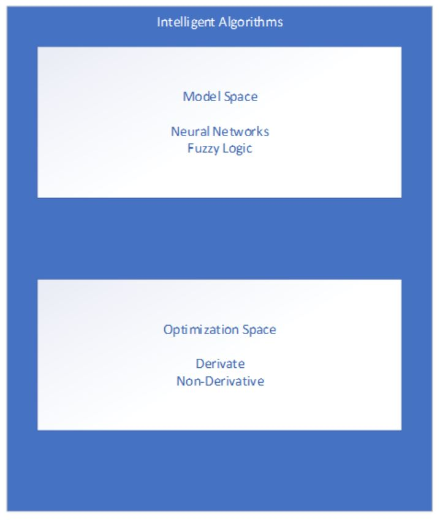

# Intelligent Algorithms

## Simplified Representation of an Intelligent Algorithm
- Derivative free: Genetic Algorithms, Particle Swarm Optimization, Ant Colony Optimization
- Derivative/Gradient Based: Least Squares, Newtonian

## [Part 1](notes/Part1/FuzzyInferenceSystems.md)
* Fuzzy Inference Systems
* Fuzzy Sets and Membership Functions

## [Part 2](notes/Part2/Part2.md)
* Linguistic Variables
* Modifiers and Connectives
* Operations and Concepts
* Generalization of T-norms and T-conorms

## [Part 3](notes/Part3/Part3.md)
* Fuzzy Logic
* Fuzzy Rules (If-Then)
* Fuzzy Implication

## [Part 4](notes/Part4/Part4.md)
* Fuzzy Composition
* Fuzzy Reasoning
* Fuzzy Inference Engine

## [Part 5](notes/Part5/Part5.md)
* Defuzzification
* Fuzzy Inference Systems
* Approximate Inference Systems

## [Part 6]()
* Fuzzy Control
* Fuzzy Control of an Inverted Pendulum

## [Part 7]()
* System Identification - TBD
* Fuzzy System Tuning via Least Squares - TBD
* Fuzzy System Design via Least Squares - TBD

## [Part 8]()
* Gradient Based Optimization - TBD
* Fuzzy System Tuning via Gradient Methods - TBD

## [Part 9]()
* Genetic Algorithms - TBD
* Particle Swarm Optimization - TBD
* Ant Colony Optimization - TBD
* Neural Networks - TBD