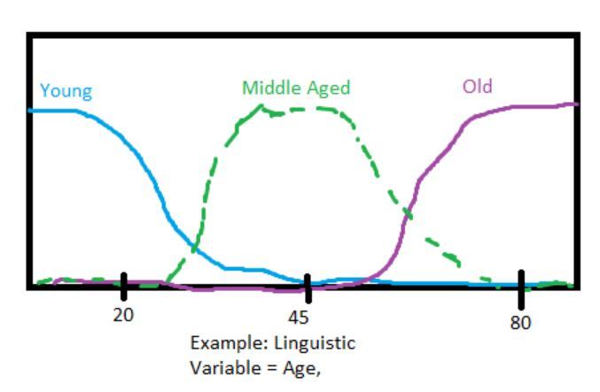
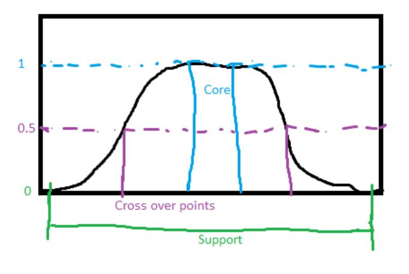
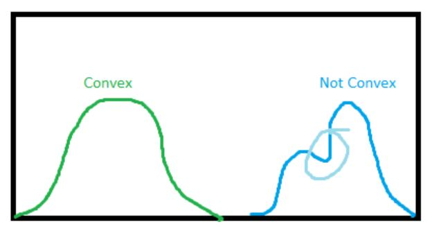
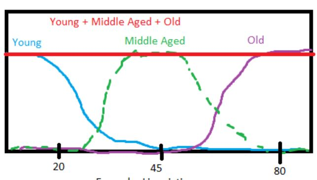
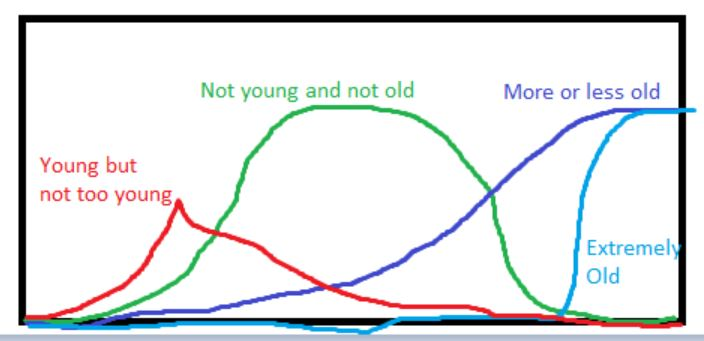

# Linguistic Variables

**Linguistic Variable:** A value described through words or sentences in natural language.
Can be refered to as a **Universe of Discourse** and is partitioned by **Fuzzy Sets**.

## Features of Membership Functions

**Support**: $\{ x \in X \mid \mu_A(x) > 0 \}$

**Core**: $\{ x \in X \mid \mu_A(x) = 1 \}$

**Crossover**: $\{ x \in X \mid \mu_A(x) = 0.5 \}$

**Normality**: A fuzzy set is **normal** if its **core** is nonempty

**Convexity**: Convex if for any $\lambda \in [0, 1]$:  $\mu_A(\lambda x_1 + (1-\lambda) x_2) \ge min(\mu_A(x_1),\mu_A(x_2))$

**Term Set**: Set of all linguistic values

**Orthogonality**: A term set is orthogonal if for each member in the universe of discourse, the sum of the linguistic values, fuzzy sets, is equal to 1, and all linguistic values are convex : $\sum_{i=1}^{n}\mu_{t_i}(x) = 1, \forall x \in X$

# Modifiers and Connectives

## Modifiers and Hedges

Special functions that modify linguistic terms ("very", "somewhat", etc).  Ex: "cold" becomes "very cold"

## Concentration and Dilation

Utilize the modification of $A -> A^k$ such that $A^k = \int_{X}[\mu_A(x)]^k / x$

**Concentration**: reduces the grade of elements that already have low grade  $CON(A) = A^{2}$

**Dilation**: increases the grade of elements that have low grade  $DIL(A) = A^{1/2}$

**Contrast Intesification**: Reduces the fuzziness of a fuzzy set.  Values above crossover shift toward 1, values below shift toward 0.

$\text{for } 0 \le \mu_A(x) \le 0.5: INT(A) = 2A^2 $

$\text{for } 0.5 < \mu_A(x) \le 1: INT(A) = \overline{2}(\overline{A})^2 $

## Connectives

Used to construct more complex concepts through words like "and" and "or."  "Hot and Sunny"

**AND**: The intersection of two fuzzy sets.  Can be implemented with the min operator.

$\text{A AND B} = A \cap B = \int_{x}[\mu_A(x)$ ^ $\mu_B(x)]/x$

**OR**: The union of two fuzzy sets.  Can be implemented with the max operator

$\text{A OR B} = A \cup B = \int_{x}[\mu_A(x)$ v $\mu_B(x)]/x$

# Fuzzy Relations: Operations and Concepts

## Concept Extension Example

Given: linguistic variables **young**, $\mu_{young}(x)$, and **old**, $\mu_{old}(x)$.

|||
|---|---|
|"more or less old"| DIL(old) = $\int_{x}\mu_{old}(x)^{0.5}/x$|
|"not young and not old"| $\overline{young} \cap \overline{old} = \int_x[1 - \mu_{young}(x)]$ ^ $[1-\mu_{old}(x)]/x$|
|"young but(and) not too(very) young"|$young \cap \overline{young}^2 = \int_x[\mu_{young}(x)]$ ^ $[1-\mu_{young}(x)^2]/x$|
|"extremely old"|CON(CON(CON(old))) = $((old^2)^2)^2 = \int_x[\mu_{old}(x)]^8/x$|

## Cartesian Product

Crisp: $U_1 \times U_2 \times \dots \times U_n = \{(u_1,u_2,\dots,u_n) \mid u_1 \in U_1, u_2 \in U_2, \dots, u_n \in U_n\}$

Fuzzy (two sets): $\mu_{A \times B}(x,y) = T[\mu_A(X), \mu_B(y)]$ where T is a T-norm function such as min().

Fuzzy (general): 
* Notation A: $\mu_{A_1 \times A_2 \times \dots \times A_n}(x_1,x_2,\dots,x_n) = T[\mu_{A_1}(x_1), \mu_{A_2}(x_2), \dots,\mu_{A_n}(x_n)]$
* Notation B: $A_1 \times A_2 \times \dots \times A_n = \sum_{(x_1,x_2,\dots,x_n)\in X_1 \times X_2 \times \dots \times X_n} \mu_{A_1 \times A_2 \times \dots \times A_n}(x_1,x_2,\dots,x_n)/ (x_1,x_2,\dots,x_n)$

## Cartesian CoProduct

Fuzzy: $\mu_{A_1 + A_2 + \dots + A_n}(x_1,x_2,\dots,x_n) = S[\mu_{A_1}(x_1), \mu_{A_2}(x_2), \dots,\mu_{A_n}(x_n)]$
where S is a T-conorm, sometimes refered to as S-norm, such as max().

## Projection

### 2D Case

Given crisp sets $x \in X$ and $y \in Y$, and fuzzy set R in $X \times Y$

Projection of $R \in {X,Y}$ onto X: $R_x = \int_X[max_y \mu_R(x,y)]/x$
Projection of $R \in {X,Y}$ onto Y: $R_y = \int_Y[max_x \mu_R(x,y)]/y$

### General Case

Given R is a fuzzy set in n-dimensional Cartesian product space $X_1 \times X_2 \times \dots \times X_n$

and the n indices are arranged as $[1,2,\dots,r,r+1,r+2,\dots,r+m-1,n]$, where r+m = n.

$R_r = \int_{X_1 \times X_2 \times \dots \times X_n}[max_{x_{r+1},x_{r+2},\dots,x_{r+m-1},x_n}\mu_R(x_1,x_2,\dots,x_n)]/(x_1,x_2,\dots,x_r)$

## Cyclindrical Extension

Extending the definition of a membership function to operate in a higher dimensional Cartesian product space.

* 2D case: $c(A) = \int_{X \times Y}\mu_A(x)/(x,y)$ where $A \in X$
* General: Given R in r-dimensional subspace $X_1 \times X_2 \times \dots \times X_r$ $r < n$,
extension into $X_1 \times X_2 \times \dots \times X_n$ space is
$c(R) = \int_{X_1 \times X_2 \times \dots \times X_n}\mu_R(x_1,x_2,\dots,x_r)/(x_1,x_2,\dots,x_n)$

# Generalization

A **General Fuzzy Complement Operator** is a continuous functin N:[0,1]->[0,1] that meets the following axioms:

|Condition|Requirement|
|---|---|
|Boundary|N(0) = 1 and N(1) = 0|
|Monotonicity|$N(a) \ge N(b) \text{ if } a \le b$|
|Involution|N(N(a)) = a|
|Change in A has a corresponding change in $\overline{A}$|$\mu_A(x_1) - \mu_A(x_2) = \mu_{\overline{A}}(x_2) - \mu_{\overline{A}}(x_1)$|

**Sugeno's Complement**: $N_s(a) = \frac{1-a}{1+s*a}$ where s > -1

**Yager's Complement**: $N_w(a) = (1-a^w)^{1/w}$ where w > 0

## Fuzzy Intersection Operator: Triangular Norm (T-norm)

A **Triangular Norm** is the **intersection** of two fuzzy sets

A **Triangular Norm Operator** is a two place function that satisfies the following axioms:

|Condition|Requirement|Notes|
|---|---|---|
|Boundary|T(0,0) = 0 and T(a,1) = T(1,a) = a|Generalize to crisp sets|
|Monotonicity|$T(a,b) \le T(c,d)$ if $a \le c \text{ and } b \le d$|Value will not increase if inputs decrease|
|Commutativity|T(a,b) = T(b,a)|order doesn't matter|
|Associativity|T(a,T(b,c)) = T(T(a,b),c)|Order of pairing doesn't matter|

Common T-norms:

|||
|---|---|
|Minimum|$T_{min}(a,b) = min(a,b) = $ a ^ b|
|Algebraic Product|$T_{ap}(a,b) = a*b$|
|Bounded Product|$T_{bp}(a,b) = 0$ v (a + b -1)|
|Drastic Product|$T_{dp}(a,b) = $ a if b = 1, b if a = 1, 0 if a,b < 1|

## Fuzzy Union Operator: Triangular Conorm (S-norm)

A **Triangular Conorm** is the union of two fuzzy sets

A **Triangular Conorm Operator** satisfies the following axioms

|Condition|Requirement|Notes|
|---|---|---|
|Boundary|S(1,1) = 1 and S(0,a) = S(a,0) = a|Generalize to crisp sets|
|Monotonicity|$S(a,b) \le S(c,d)$ if $a \le c \text{ and } b \le d$|Value will not increase if inputs decrease|
|Commutativity|S(a,b) = S(b,a)|order doesn't matter|
|Associativity|S(a,S(b,c)) = S(S(a,b),c)|Order of pairing doesn't matter|

Common S-norms

|||
|---|---|
|Maximum|$S_{max}(a,b) = max(a,b) = $ a v b|
|Algebraic Sum|$S_{as}(a,b) = a + b - a*b$|
|Bounded Sum|$S_{bs}(a,b) = $ 1 ^ (a+b)|
|Drastic Sum|$S_{ds}(a,b) = $ a if b = 0; b if a = 0; 1 if a,b > 0|

[Part3](../Part3/Part3.md)
