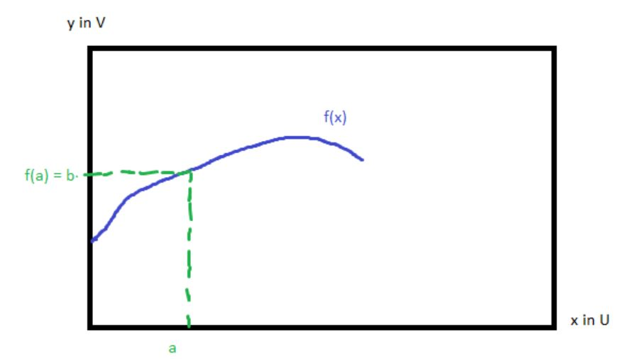
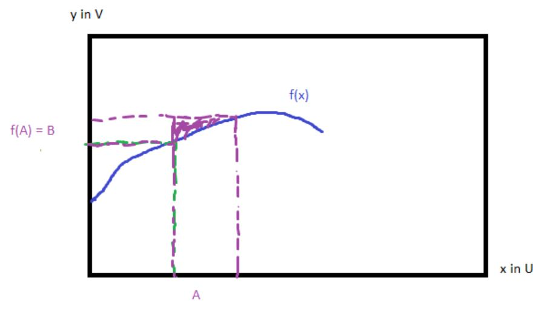
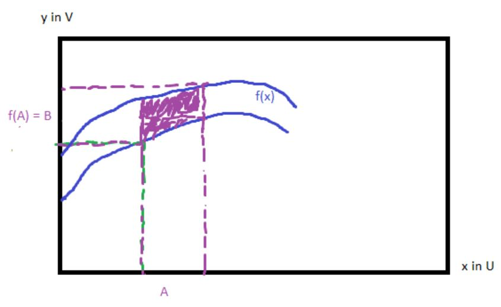
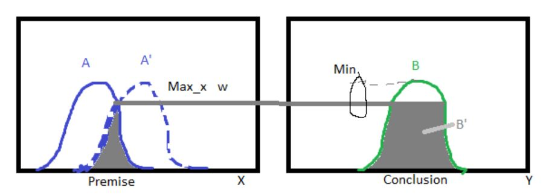
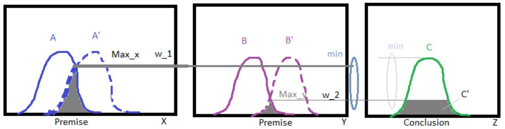
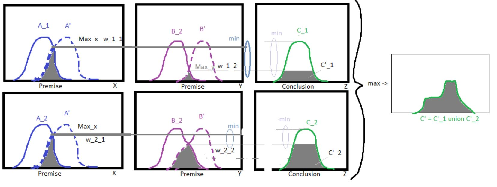
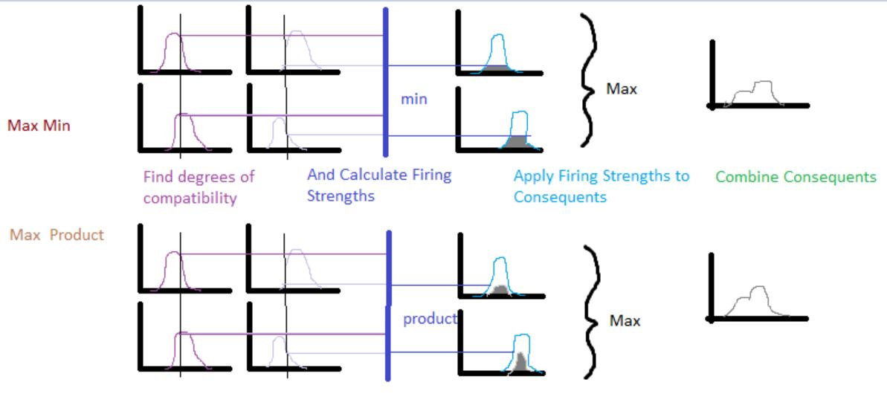

# Fuzzy Composition

Deriving the degree of consistency between two fuzzy relations

Given universes X, Y, Z and relations R and S where R maps XxY and S maps YxZ, we can generate a new relation: the composition of R and S, $R \circ S$

## Max-min Composition

Uses intersection, min, and projection, max, to determine the degree of consistency between the two fuzzy relations defined as

$R_1 \circ R_2 = \{ ((x,z),max_y min[\mu_{R_1}(x,y), \mu_{R_2}(y,z)]) \mid x \in X, y \in Y, z \in Z \}$

$= \mu_{R_1 \circ R_2}(x,z)$ 

## Max-product Composition

Uses intersection, product, and projection, max. Easier to do mathematical analysis than with max-min.

$R_1 \circ R_2 = \{ ((x,z),max_y[\mu_{R_1}(x,y) * \mu_{R_2}(y,z)]) \mid x \in X, y \in Y, z \in Z \}$

### Conditional Properties of Composition

|||
|---|---|
|Associativity $X_2=X_3; X_4=X_5$|$R \circ (S \circ T) = (R \circ S) \circ T$|
|Distributivity over Union $X_2=X_3=X_5; X_4=X_6$|$R \circ (S \cup T) = (R \circ S) \cup (R \circ T)$|
|Distributivity over Intersection $X_2=X_3=X_5; X_4=X_6$|$R \circ (S \cap T) \subseteq (R \circ S) \cap (R \circ T)$|
|Monotonicity $X_1=X_3; X_2=X_4$|$S \subseteq T$ -> $R \circ S \subseteq R \circ T$|

# Fuzzy Reasoning

A procedure to derive conclusions from a set of fuzzy if-then rules and facts.

## General Procedure, Functional Mapping

* Consider a function y=f(x) where $x \in U \text{ and } y \in V$
* and we are give the fact x = a, we can then infer y=b from f(a)=b

Now consider extending this example.

* First by expanding a into an interval A and projecting f(A) onto the interval B

* Second by expanding the dimensionality of f(x), which hopefully gives intuition for multiple sets
* Solve for interval B=f(A) by taking the intersection of A with f(x), $A \cap f(x)$. and then projecting onto $y \in V$

## Compositional Rule of Inference, CRoI

Given
* A,B,A',B' are fuzzy sets with membership functions $\mu_A(x), \mu_{A'}(x) \text{ and } \mu_B(y)$
* Mamdani implication: "A coupled with B"
* T-norm is min, intersection of fact and rule
* T-conorm is $max_x$ projection to output space
* R is fuzzy implication A->B with membership function $\mu_R(x,y)$
* Cylindrical extension of A' is $\mu_{c(A')}(x,y)$

Our result is $\mu_{B'}(y) = max_x[min[\mu_{c(A')}(x,y),\mu_R(x,y)]]$

Steps broken down:
1. Rule product space, R=A->B, Fuzzy relation R on XxY
2. Cylindrical extension of the fact A', c(A')
3. Intersection of fact and rule, min(c(A'),R) $min[\mu_{c(A')}(x,y),\mu_R(x,y)]$
4. Projection to output space, min(c(A'),R) onto Y, $max_x[\dots]$ -> $\mu_{B'}(y)$

### One Fact One Rule Example

* Implication: A coupled with B, $\mu_A(x)$ ^ $\mu_B(y)$ = $\mu_R(x,y)$
* T-norm: min
* T-conorm: max
* B' = A' $\circ$ (A->B)
* premise: x is A'
* rule: if x is A then y is B
* consequent: y is B'

$\mu_{B'}(y) = max_X[\mu_{A'}(x)$ ^ $\mu_R(x,y)] = max_X[\mu_{A'}(x)$ ^ $[\mu_A(x)$ ^ $\mu_B(y)]]$ 

$= max_X[\mu_{A'}(x)$ ^ $\mu_A(x)$ ^ $\mu_B(y)] = max_X[\mu_{A'}(x)$ ^ $\mu_A(x)]$ ^ $\mu_B(y)$; Rule firing strength $\omega = [\mu_{A'}(x)$ ^ $\mu_A(x)]$

$= \omega$ ^ $\mu_B(y)$

### Single Rule, Multiple Antecedents AND $C' = (A' \times B') \circ (A \cap B$ -> $C)$
* Implication: A coupled with B
* T-norm: min
* T-conorm: max
* premises: x is A', y is B'
* rule: if x is A AND y is B then z is C
* consequent: z is C'

$\mu_{C'}(z) = max_{X,Y}[\mu_{A'}(x) \wedge \mu_{B'}(y) \wedge [\mu_A(x) \wedge \mu_B(y) \wedge \mu_C(z)]]$

$= \{ max_X[\mu_{A'}(x) \wedge \mu_A(x)] \wedge max_Y[\mu_{B'}(y) \wedge \mu_B(y)] \} \wedge \mu_C(z)$

$= (\omega_1 \wedge \omega_2) \wedge \mu_C(z)$

Weakest degree of belief is propagated

### Single Rule, Multiple Antecedents OR $C' = (A' \times B') \circ (A \cup B$ -> $C)$
* Implication: A coupled with B
* T-norm: min
* T-conorm: max
* premises: x is A', y is B'
* rule: if x is A OR y is B then z is C
* consequent: z is C'

$\mu_{C'}(z) = \vee_{X,Y}[\mu_{A'}(x) \wedge \mu_{B'}(y) \wedge [\mu_A(x) \vee \mu_B(y) \wedge \mu_C(z)]]$

$= \vee_X[\mu_{A'}(x) \wedge \mu_A(x) \wedge \mu_C(z)] \vee \vee_Y[\mu_{B'}(y) \wedge \mu_B(y) \wedge \mu_C(z)]$

$= (\omega_1 \vee \omega_2) \wedge \mu_C(z)$

Strongest degree of belief is propagated

## Decomposition

A single rule with multiple antecedents can be represented as multiple rules with single antecedents.

This helps with illustrating the combination of multiple rules.

$C' = (A' \times B') \circ (A \cap B \rightarrow C)$ can be decomposed to $C' = [A' \circ (A \rightarrow C)] \cap [B' \circ (B \rightarrow C)]$

$\mu_{C'}(z) = \vee_{X,Y}[\mu_{A'}(x) \wedge \mu_{B'}(y) \wedge [\mu_A(x) \wedge \mu_B(y) \wedge \mu_C(z)]]$

$= \vee_X[\mu_{A'}(x) \wedge \mu_A(x) \wedge \mu_C(z)] \wedge \vee_Y[\mu_{B'}(y) \wedge \mu_B(y) \wedge \mu_C(z)]$

$= \mu_{A' \circ (A \rightarrow C)}(x) \wedge \mu_{B' \circ (B \rightarrow C)}(y)$

Weakest belief propagated in this scenario.

## Combining Multiple Fuzzy Rules
* Implication: A coupled with B
* T-norm: min
* T-conorm: max
* premises: x is A', y is B'
* rules: $R_1 = A_1 \cap B_1 \rightarrow C_1$ and $R_2 = A_2 \cap B_2 \rightarrow C_2$
* Rules combined via union of fuzzy conclusions: $C' = (A' \times B') \circ (R_1 \cup R_2) = [(A' \times B') \circ R_1] \cup [(A' \times B') \circ R_2] = C_1' \cup C_2'$

## Fuzzy Singleton Simplification

Imagine replacing A' with a singular value, possibly by setting the membership function to a dirac delta function.  Or these can be thought of as crisp inputs.

## Fuzzy Reasoning Summary using Simplified Max-min and Max-product examples

Note: the end result in this pipeline is the Overall Implied Fuzzy Set

# Fuzzy Inference Engine

## Generalization: how to we set up an inference engine

* Facts: $x_1 is A_1', x_2 is A_2', \dots, x_n is A_n'$
* Rule i: if $x_1$ is $A_{i,1}$ and $x_2$ is $A_{1,2}$ and $\dots$ and $x_n$ is $A_{i,n}$ then y is $B_i$
* conclusion: $y_i$ is $B_i'$

$R_i = (A_{i,1} \cap A_{i,2} \cap \dots \cap A_{i,n}) \rightarrow B_i; i = 1,2,\dots,P$

Overall Implied Fuzzy Set B' = $B_1' \cup B_2' \cup \dots \cup B_P' = (A_1' \times A_2' \times \dots \times A_n') \circ (R_1 \cup R_2 \cup \dots \cup R_P)$

## Max-Product Inference Engine PIE
|||
|---|---|
|OIFS|$\mu_{B'}(y)$|
|$\cup$ (max)|$\bigvee_{k=1}^{P}$|
|Cylindrical Extension of $A_1' \times A_2' \times \dots \times A_N'$|$\mu_{c(A')}(x_1,x_2,\dots,x_N)$|
|Rule k, A coupled with B, $k=1,2,\dots,P$|$(\prod_{i=1}^{N} \mu_{A_i}^{k}(x_i))* \mu_{B}^{k}(y)$|
|Max-product composition of $R_i$|$\bigvee_{(X_1,X_2,\dots,X_N)}[\mu_{c(A')}(x_1,x_2,\dots,x_N) * (\prod_{i=1}^{N} \mu_{A_i}^{k}(x_i))* \mu_{B}^{k}(y)]$|
|PIE|$\mu_{B'}(y) = \bigvee_{k=1}^{P} \{ \bigvee_{(X_1,X_2,\dots,X_N)}[\mu_{c(A')}(x_1,x_2,\dots,x_N) * (\prod_{i=1}^{N} \mu_{A_i}^{k}(x_i))* \mu_{B}^{k}(y)] \}$|

## Simplified PIE

Apply fuzzy singleton fuzzification to PIE above:

$\mu_{B'}(y) = \bigvee_{k=1}^{P} \{ \prod_{i=1}^{N}[ \mu_{A_i}^{k}(x_i)]* \mu_{B}^{k}(y) \}$

## Max-Min Inference Engine MIE
|||
|---|---|
|OIFS|$\mu_{B'}(y)$|
|$\cup$ (max)|$\bigvee_{k=1}^{P}$|
|Cylindrical Extension of $A_1' \times A_2' \times \dots \times A_N'$|$\mu_{c(A')}(x_1,x_2,\dots,x_N)$|
|Rule k, A coupled with B, $k=1,2,\dots,P$|$[\bigwedge_{i=1}^{N} \mu_{A_i}^{k}(x_i)] \wedge \mu_{B}^{k}(y)$|
|Max-product composition of $R_i$|$\bigvee_{(X_1,X_2,\dots,X_N)}[\mu_{c(A')}(x_1,x_2,\dots,x_N) \wedge [\bigwedge_{i=1}^{N} \mu_{A_i}^{k}(x_i)] \wedge \mu_{B}^{k}(y)]$|
|MIE|$\mu_{B'}(y) = \bigvee_{k=1}^{P} \{ \bigvee_{(X_1,X_2,\dots,X_N)}[\mu_{c(A')}(x_1,x_2,\dots,x_N) \wedge [\bigwedge_{i=1}^{N} \mu_{A_i}^{k}(x_i)] \wedge \mu_{B}^{k}(y)] \}$|

## Simplified MIE

Like simplified PIE, apply fuzzy singleton fuzzification to MIE

$\mu_{B'}(y) = \bigvee_{k=1}^{P} \{ [\bigwedge_{i=1}^{N} \mu_{A_i}^{k}(x_i)] \wedge \mu_{B}^{k}(y) \}$

[Part5](../Part5/Part5.md)