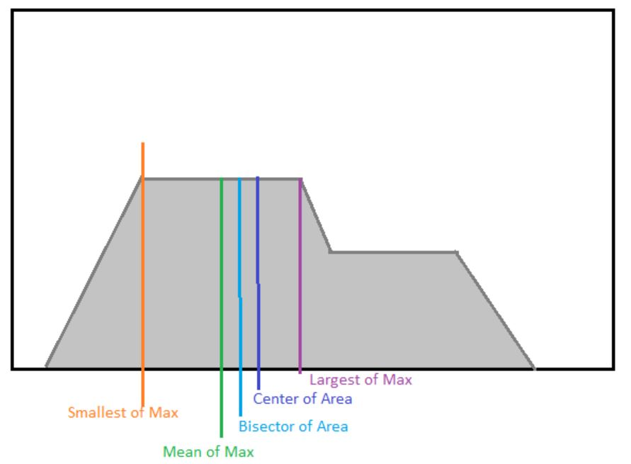

# Defuzzification

Now that we have an Overall Implied Fuzzy Set, we want to extract values from it.
Defuzzification is how we can get crisp values from a fuzzy set.

## Common Defuzzification Strategies

|Strategy|Calculation|Notes|
|---|---|---|
|Mean of max MoM|$\frac{\prod_{Z'}z dz}{\prod_{Z'}dz}$ where $Z' = \{ z \mid \mu_{out}(z) = \mu^{*} \}$|Does not accout for shape; more computationally efficient than CoA|
|Centroid of Area CoA, Center of Gravity CoG|$\frac{\prod_{Z}\mu_{out}(z)zdz}{\prod_{Z}\mu_{out}(z)dz}$| Accounts for entire shape; higher computational cost with possible reductions in certain cases|
|Center Average|$\frac{\sum_{k=1}^{M}z_kh_k}{\sum_{k=1}^{M}h_k}$|Pretty good approximation of CoA|
|Smallest of Max SoM|$min\{ z \mid \mu_{out}(z) = \mu^{*} \}$||
|Largest of Max LoM|$max\{ z \mid \mu_{out}(z) = \mu^{*} \}$||
|Bisector of Area BoA||Requires solving an integral inequality...|

# Fuzzy Inference Systems

## Simplified Product Inference Engine with CA Defuzzification

$y = f(\vec{x}) = \frac{\sum_{k=1}^{P} \vec{y}^{k} \prod_{i=1}^{N}\mu_{A_i}^{k}(x_i)}{\sum_{k=1}^{P} \prod_{i=1}^{N}\mu_{A_i}^{k}(x_i)}$ where $\vec{x} = [x_1, x_2, \dots x_N]^{T}$

$\omega_{p,n} =$ premise weights

$\vec{y}^P = $ conclusion centers

$= \frac{[(\omega_{1,1}* \dots * \omega_{1,N})* \vec{y}^1] + \dots + [(\omega_{P,1}* \dots * \omega_{P,N})* \vec{y}^P]}{[(\omega_{1,1}* \dots * \omega_{1,N})] + \dots + [(\omega_{P,1}* \dots * \omega_{P,N})]}$

## Simplified Minimum Inference Engine with CA Defuzzification

$y = f(\vec{x}) = \frac{\sum_{k=1}^{P} \vec{y}^{k} [\bigwedge_{i=1}^{N}\mu_{A_i}^{k}(x_i)]}{\sum_{k=1}^{P} [\bigwedge_{i=1}^{N}\mu_{A_i}^{k}(x_i)]}$ where $\vec{x} = [x_1, x_2, \dots x_N]^{T}$

# More Approximate Inference Systems

## Sum-Product Inference with CoA Defuzzification

$y = f(\vec{x}) = \frac{\sum_{k=1}^{P}\omega_k a_k y_k}{\sum_{k=1}^{P}\omega_k a_k}$

where $a_k = \int_{Y}\mu_{B^k}(y)dy$ or the area of the MF; $y_k = \int_{Y}\mu_{B^k}(y)y dy / a_k$ or the centroid of the MF.

## Sum-Min Inference with CoA Defuzzification

$y = f(\vec{x}) = \frac{\sum_{k=1}^{P}\tilde{a}_k y_k}{\sum_{k=1}^{P}\tilde{a}_k}$

$\tilde{a}_k = \int_Y[\omega_k \wedge \mu_{B}^{K}(y)]$ or area of enclosed

$y_k = \int_Y[\omega_k \wedge \mu_{B}^{K}(y)]y dy / \tilde{a}_k$ or centroid of enclosed

## Takagi-Sugeno-Kang Fuzzy Model (TSK)

## Tsukamoto Model

# Design Considerations

## Guidelines

### Architecture
1. Choose Fuzzy Inference System + Defuzzification Strategy
2. Select input and output variables (linguistic variables)
3. Determine the number of linguistic values per linguistic variable
4. Apply domain expert knowledge to develop IF-THEN rules and membership functions

### Performance
1. Refine rules through heuristics and optimization
2. Refine membership function parameters and modifiers through optimization

## How many rules are needed?

* $k_i$ = number of inputs, linguistic variables
* $N_i$ = number of values per input, linguistic values
* R = number of rules

$R = \prod_{i=1}^{varcount}N_{i}^{k_i}$